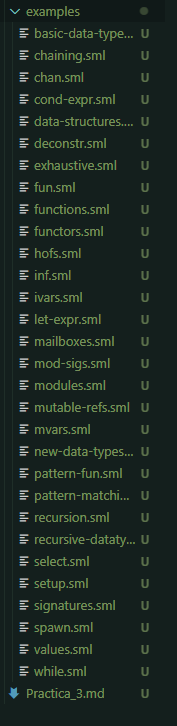

# Reporte Practica 2 de la Clase Paradigmas de Programacion
## Alumno Diego Demian Quiros Vicencio - 372688

## Que es el aprendizaje automatico estandar?

Standard ML es un lenguaje de programación funcional de propósito general. Tiene un tipo estático, lo que evita una amplia gama de errores de programación comunes, pero también presenta una potente inferencia de tipos, que requiere pocas declaraciones de tipos, si es que hay alguna. Esto facilita la creación de software que sea fácil de entender, extensible y confiable.

## Iniciando el tour por el lenguaje de programacion ML estandar!
El recorrido consta de una serie de capítulos, cada uno de los cuales pretende mostrar diferentes características de Standard ML. Hay ejemplos incluidos en el recorrido por el repositorio de Standard ML . Puede ver la tabla de contenido a través del menú 'Tabla de contenido' en la parte superior de la pantalla y navegar entre las páginas con las flechas en la barra de navegación o mediante las teclas de flecha del teclado.

## [Repositorio](https://github.com/Saityi/a-tour-of-standard-ml/tree/master/examples)

Descargar ejemplos.
Algunos de los codigos que vienen en el tour son los siguientes
#### basic-data-types.sml
```sml
(* Unit -- has only one value: () *)
val u : unit = ()

(* Booleans : bool *)
val b : bool = true

(* Integers : int *)
val i : int = 1

(* Note that negation is performed using a tilde *)
val iNegative = ~1

(* Floating point numbers : real *)
val r : real = 2.0

(* Note that negation is performed using a tilde *)
val rNegative = ~2.0

(* Strings : string *)
val s : string = "s"

(* ASCII Characters : char *)
val c : char = #"c"
```

#### chan
```sml
fun sum s c = CML.send (c, foldr (op +) 0 s)

fun formatOutput x y =
  Int.toString x ^ " " ^ Int.toString y ^ " " ^ Int.toString (x + y) ^ "\n"

fun main () =
  let
    open String
    val s = [7, 2, 8, ~9, 4, 0]
    val ch = CML.channel ()
    val slen = (List.length s div 2)
    val x = ref 0
    val y = ref 0
  in (
    CML.spawn (fn () => sum (List.take (s, slen)) ch);
    CML.spawn (fn () => sum (List.drop (s, slen)) ch);
    x := CML.recv ch;
    y := CML.recv ch;
    print (formatOutput (!x) (!y))
  )
  end

val _ = RunCML.doit(main, NONE)

```

y vienen muchisimos ejemplos mas.


## Prerequisitos para poder ejecutar los codigos 
- Instalar Standard ML of New Jersey: [https://www.smlnj.org/](https://www.smlnj.org/)
    - SML/NJ contiene un administrador de compiladores interactivo/REPL que se utilizará para los ejemplos a lo largo de este recorrido.
    - SML/NJ también instalará una implementación de la biblioteca estándar, la biblioteca básica SML.
- Asegúrese de que SML/NJ se haya agregado a la ruta según corresponda para su arquitectura
